<p align="center">
  
</p>

## 👨‍💻 About me

<table>
  <tr>
    <td width="40%" align="center">
      
    </td>
    <td width="60%">

<sub><code>PLAYER PROFILE</code></sub>

```yaml
player:  Dai Ho Trong  # Daniel · TiDi
class:   Full-stack Developer
guild:   cyber security for IoT (EU)
base:    Ho Chi Minh City, VN  # UTC+7
xp:      in production since 2020
stance:  pragmatic > dogmatic
passive: can't leave a pain point alone
```

[](mailto:tidi.dev1321@gmail.com)
[](https://t.me/tidi1321)

</td>
  </tr>
  <tr>
    <td colspan="2">

I'm **Dai** — Daniel in English, **TiDi** around here. Officially full-stack; in practice I end up on the backend most days: shaping APIs, modeling data, wiring services together and keeping the infrastructure underneath them honest. The path so far went from Laravel apps to AWS serverless to event-driven NestJS microservices. I once built a career-path platform on top of RPG quest mechanics, which probably explains the rest of this page.

</td>
  </tr>
</table>

## 🧭 How I think

> **There's no perfect system — only trade-offs you choose on purpose.**

I'm still learning system design, and I expect that to stay true for a long time. I'm a bit addicted to the problem itself: a real pain point, the constraints boxing it in, and the handful of ways out. I'd rather lay the options side by side and argue through the trade-offs than grab the first answer that compiles. Every architecture is a set of compromises; the job is understanding the requirements well enough to pick the right ones.

That's also why I like being the person teammates come to when something hurts. Bring me the problem, the constraints and the context. I'll dig in until I understand it, talk through the options with you, and suggest the most practical fix I can with what I know today. If I'm wrong, I'd rather find out early — that's where the XP comes from.

Every build has buffs and debuffs. A few I've picked and lived with:

```diff
@@ microservices over NATS @@
+ each service deploys and scales on its own
- one request, five places to look when it breaks

@@ ledger entry + balance update in one transaction @@
+ a customer's debt can never drift from its history
- hot balance rows, more lock contention

@@ push heavy work onto a BullMQ queue @@
+ the API answers fast
- "done" now means "eventually done"
```

## ⚔️ Current quests

<sub>What I'm working on right now.</sub>

### 🛡️ Main quest · Hardware-security platform

`cybersecurity` `IoT` `Europe`

> **Objective:** prove a device is genuine before anything trusts it.

I work in the cybersecurity domain for a European IoT company. Every device carries an S\*\*\*\* security chip with its own identity, and the platform I work on is the backend that verifies the chip — and the device hosting it — is the real thing. My part: authentication mechanisms, the chip lifecycle, and end-to-end solution design.

- **Challenge-response authentication** — send the chip a random challenge, validate its cryptographic answer. Token, host, mutual, daisy-chain (multi-chip) and secure-boot attestation flows.
- **Chip lifecycle & provisioning** — serials from manufacturing to the field: mask and bitstring exports for suppliers, token clusters, device groups and lifecycle states, all audit-logged.
- **Anomaly detection & multi-tenancy** — detectors catch geolocation jumps, unusual auth frequency and slow challenge-response timing, then raise Slack-alerted incidents. Each tenant gets its own portal with CASL role-based access.

<sub><b>Stack:</b> Nx monorepo · NestJS microservices over NATS · TypeORM · PostgreSQL · Redis/BullMQ · React portals · Azure Key Vault · Application Insights</sub>

### 🗺️ Side quest · botmivivi

`B2B distribution` `Vietnam` `live in production`

> **Objective:** replace paper receipts, Excel files and Zalo threads with numbers that keep themselves correct.

A back office for a wholesale flour and baking-ingredient distributor. They buy by the bag and the ton, sell on credit to bakeries and shops, and deliver with their own trucks, drivers and loaders. One NestJS + PostgreSQL system of record now owns the numbers that used to live in people's heads.

| 👾 Boss (pain point) | ⚔️ How it goes down |
| :-- | :-- |
| **Debt that never adds up** — almost every sale is on credit | Every order, return, payment and fee writes a ledger entry and moves the balance in the same transaction. Debt is derived, never retyped; payments split across invoices with a full audit trail. |
| **Margin leaking one order at a time** — prices are negotiated per customer | Every delivered price joins that customer's whitelist. Anything outside it is flagged at order entry and pushed to Slack. Customers can also lock a price in advance and prepay against it. |
| **Month-end payroll arguments** — loaders are paid by tonnage | Every kilo moved becomes a work item priced at a rate frozen on creation. Payroll is a query. |
| **Stock nobody trusts** — bags leave, some come back, batches mix | Batch-level FEFO inventory, with every movement tagged by its source. |

<details>
<summary><b>More loot from this quest</b></summary>

<br>

- Delivery trips tying orders to a truck, a driver and a date
- A background worker that learns each customer's reorder interval and predicts the next order
- Nightly Slack reports for inventory, orders, receipts and cash
- Excel exports across every module; CASL permissions with JWT + refresh tokens
- Companion apps: a Vue 3 back office (Pinia, Naive UI, Tailwind, ECharts), a mobile app for the field team, and an end-to-end test suite

<sub><b>Stack:</b> NestJS 10 · Prisma 6 · PostgreSQL · Redis/BullMQ · ~40 models</sub>

</details>

## 🎒 Loadout

<sub>The tech stack, sorted by the slot it fills.</sub>

| Slot | Gear | Field notes |
| :-- | :-- | :-- |
| **Main hand**<br><sub>languages · backend</sub> |     | Default weapon. Most of my APIs and services are NestJS. |
| **Off-hand**<br><sub>frontend</sub> |    | Admin portals and back offices. |
| **Storage**<br><sub>databases</sub> |      | Postgres is my usual system of record. |
| **Messaging**<br><sub>async</sub> |   | How services talk, and where slow work waits its turn. |
| **Terrain**<br><sub>cloud</sub> |   | Serverless on AWS before; Azure today. |
| **Armor**<br><sub>DevOps · SRE</sub> |      | Infrastructure as code, pipelines as code. |
| **Scouting**<br><sub>observability</sub> |   | Seeing the problem before users report it. |
| **Companions**<br><sub>AI</sub> |   | Pair programmers and rubber ducks. |
| **Alt builds**<br><sub>other</sub> | `PHP` `Laravel` `Symfony` `Python` `Flask` | Still in the bag, just not my main. |

## 🌳 Skill tree

<sub>What I'm learning. Nothing here is maxed, and that's the point.</sub>

```text
$ tree ~/system-design
~/system-design
├── [x] api-design           boundaries, contracts, NestJS modules
├── [x] event-driven         request-reply vs. events, contracts
├── [x] ledgers              two-sided debt, allocations, audits
├── [x] background-jobs      retries, progress, bulk exports
├── [x] multi-tenancy        tenant isolation, roles, delegation
├── [~] distributed-systems  consistency, idempotency, failure modes
├── [~] reliability-sre      observability, alerting, incident flow
├── [~] infra-as-code        Terraform, Kubernetes, GitOps
└── [~] ai-in-the-loop       Claude & ChatGPT as pair programmers

5 unlocked [x], 4 leveling up [~]
```

## 🎮 AFK

<sub>Away from keyboard, not offline.</sub>

<table>
  <tr>
    <td align="center" width="33%">
      ⚽ 🏸 🏊<br>
      <b>Football · Badminton · Swimming</b><br>
      <sub>Where I refill HP.</sub>
    </td>
    <td align="center" width="33%">
      🎮<br>
      <b>Games</b><br>
      <sub>Where this page got its vocabulary, and where I learned there's no perfect build.</sub>
    </td>
    <td align="center" width="33%">
      ☕ 💬<br>
      <b>Tech gossip</b><br>
      <sub>Coffee plus "how would you design this?" — a side quest I never turn down.</sub>
    </td>
  </tr>
</table>

---

<p align="center">
  <sub>Got a pain point? Bring the constraints — I'll bring the trade-offs.</sub><br>
  <sub><code>💾 progress saved · still learning, always solving</code></sub>
</p>
